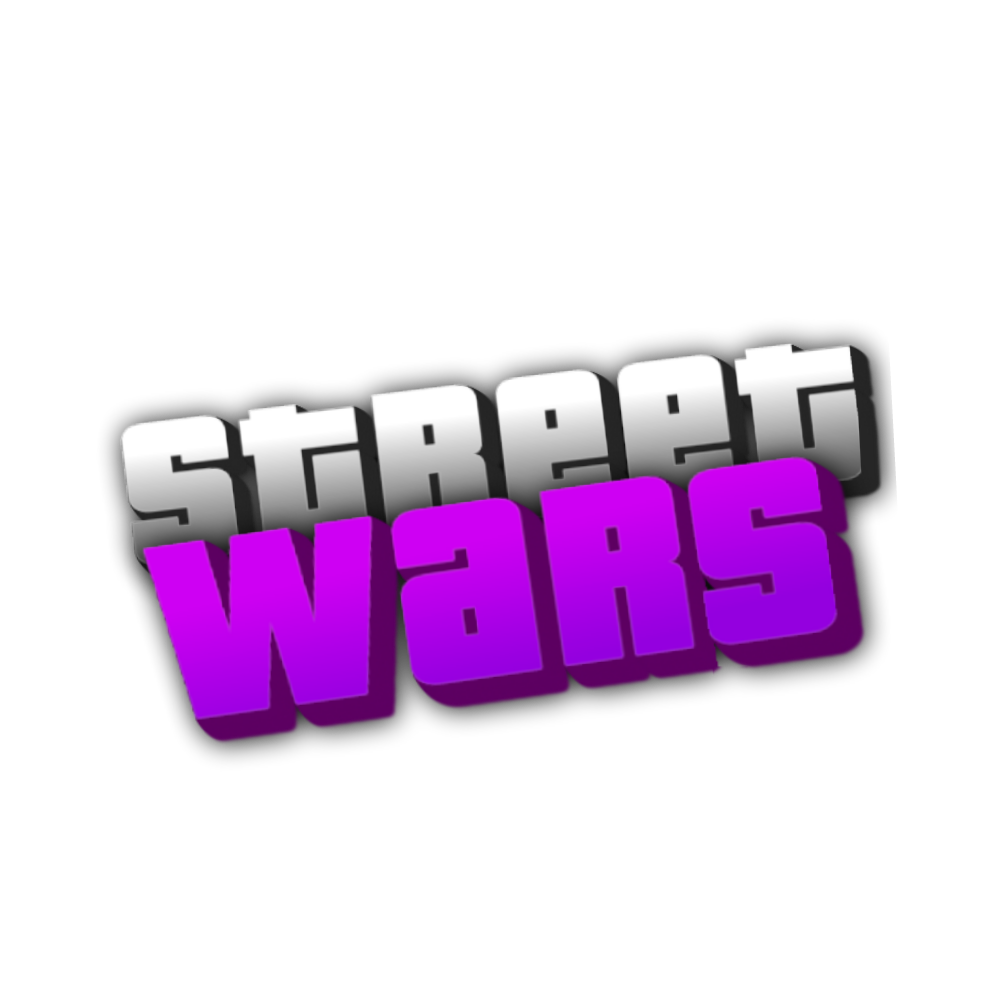

# Street Wars

O Street Wars é um servidor de guerra de gangues para o SA-MP 0.3.7 criado em Jun 2020 e encerrado no primeiro trimestre de 2021.
- Gamemode escrito por Dalhy @dalhy.
- Mapas feitos por Lucas H @OLucassBR.
- Sistemas auxiliares por Luquinhas @Luquinhass (Não incluídos).

## Implementações
- [x] Sistema de registro e login.
- [x] Sistema de domínio de territórios.
- [x] Sistema de roubo.
- [x] Sistema de conquistas e habilidades.
- [x] Sistema de benefícios VIP.
- [x] Opção de seleção/troca de organização/gangue.
- [x] Lojas de armas e terroristas no mapa.

## Depêndencias
1. Include dof2, streamer, sscanf & pawn.cmd.
2. Plugin streamer, sscanf & pawn.cmd.

## Rodando
1. Coloque o gamemode e suas depêndencias no diretório do seu `samp-server`.
2. Adicione os plugins necessários em seu `server.cfg > plugins`.
3. Inicie o seu `samp-server`.
